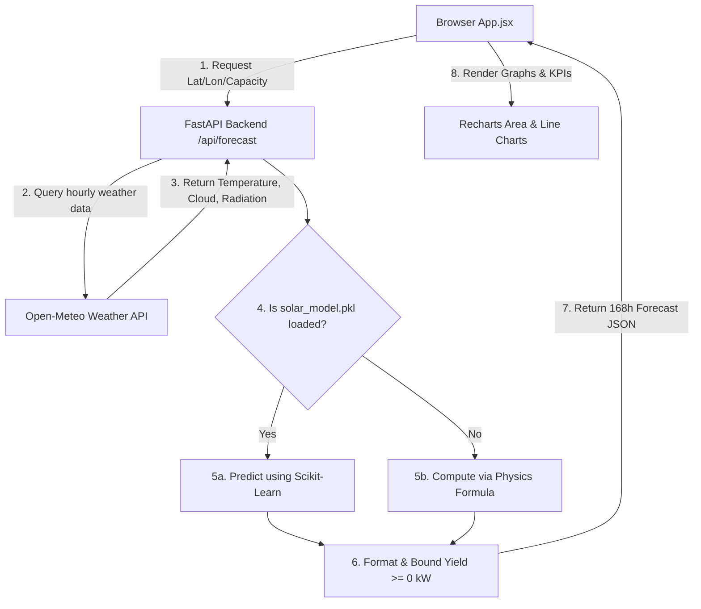

# HeliosForecast ☀️

HeliosForecast is a full-stack, production-ready web application dashboard that predicts solar energy generation yield (in kW) for an installed solar array over the upcoming 7 days. It retrieves real-time weather parameters from the free, keyless Open-Meteo API and routes them through a Machine Learning model (with an advanced mathematical environmental fallback system).

---

## 🌟 Key Features

*   **Real-time Meteorology Integration**: Queries hourly temperature, cloud cover, and shortwave solar radiation from Open-Meteo.
*   **Dual Yield-Calculation Engine**:
    *   **ML Model Mode**: Attempts to load and predict using `solar_model.pkl` (scikit-learn pipeline).
    *   **Physics-based Fallback**: Simulates panel degradation at temperatures above 25°C and scales yield based on cloud attenuation values.
*   **Aesthetic & Modern Dashboard**:
    *   **3 KPI Cards**: Instantly displays Max Yield (kW), Average Solar Radiation ($W/m^2$), and Average Temperature (°C).
    *   **7-Day Energy Forecast**: Implements a smooth Recharts AreaChart with amber gradient fills and interactive tooltips.
    *   **Daylight Correlation Chart**: A dual Y-axis LineChart comparing daylight energy yield (Green) and cloud levels (Blue dashed) for a selected day.
*   **Preset Solar Array Coordinator**: Single-click preset selections for solar arrays in Phoenix, Los Angeles, London, and Sydney.
*   **Docker Containerized**: Built-in support for standard multi-stage builds and simple orchestration via Docker Compose.

---

## 🏗️ System Architecture



---

## 🛠️ Technology Stack

| Component | Technology | Primary Libraries |
| :--- | :--- | :--- |
| **Backend API** | Python 3.12 / FastAPI | `uvicorn`, `requests`, `scikit-learn`, `numpy`, `joblib` |
| **Frontend UI** | React 19 / Vite | `tailwindcss`, `@tailwindcss/postcss`, `recharts`, `lucide-react` |
| **Web Server** | Nginx | Default reverse proxy config for React SPAs |
| **Containerization**| Docker | `docker-compose.yml`, multi-stage `Dockerfile` configurations |

---

## 🚀 Deployment Instructions

### Method 1: Containerized Deployment (Recommended)

You must have **Docker** and **Docker Compose** installed on your host.

1.  Clone the project repository and navigate to the directory:
    ```bash
    cd "Project Helios"
    ```
2.  Launch the services in detached mode using Docker Compose:
    ```bash
    docker compose up -d --build
    ```
3.  **Access the Dashboard**:
    *   **Frontend Client**: [http://localhost](http://localhost) (Port 80)
    *   **Backend API**: [http://localhost:8000](http://localhost:8000) (Swagger Docs available at `/docs`)

---

### Method 2: Local Manual Setup

#### Step 1: Run the Backend
1.  Navigate to the `/backend` folder:
    ```bash
    cd backend
    ```
2.  Create and activate a virtual environment:
    ```bash
    python -m venv venv
    # On Windows PowerShell:
    .\venv\Scripts\Activate.ps1
    # On Linux/macOS:
    source venv/bin/activate
    ```
3.  Install dependencies:
    ```bash
    pip install -r requirements.txt
    ```
4.  Launch the server:
    ```bash
    python main.py
    ```
    *The API will start at [http://localhost:8000](http://localhost:8000).*

#### Step 2: Run the Frontend
1.  Open a new terminal and navigate to the `/frontend` folder:
    ```bash
    cd frontend
    ```
2.  Install packages:
    ```bash
    npm install --legacy-peer-deps
    ```
3.  Start the Vite hot-reloading dev server:
    ```bash
    npm run dev
    ```
    *The client will start, typically at [http://localhost:5173](http://localhost:5173).*

---

## 📈 API Endpoint Details

### `GET /api/forecast`

Retrieves weather variables and predicts solar generation.

**Query Parameters:**
*   `lat` (float, required): Latitude of the solar array location.
*   `lon` (float, required): Longitude of the solar array location.
*   `system_capacity_kw` (float, optional, default: `5.0`): Installed capacity rating of the array.

**Example Request:**
```http
GET http://localhost:8000/api/forecast?lat=33.4484&lon=-112.0740&system_capacity_kw=5.0
```

**Example Response (Truncated JSON Array):**
```json
[
  {
    "time": "2026-06-08T06:00",
    "temperature": 32.5,
    "cloudCover": 10,
    "radiation": 88.0,
    "predictedYieldKw": 0.082
  },
  {
    "time": "2026-06-08T12:00",
    "temperature": 40.1,
    "cloudCover": 0,
    "radiation": 985.0,
    "predictedYieldKw": 0.926
  }
]
```

---

## ⚙️ Mathematical Model Details

If the pre-trained `solar_model.pkl` classifier is missing from `/backend`, the system activates the physics-based fallback formula:

$$\text{predicted\_kw} = \text{capacity} \times \frac{\text{radiation}}{1000} \times \left(0.20 \times \left(1 - \max\left(0, (\text{temp} - 25) \times 0.004\right)\right)\right) \times \left(1 - \frac{\text{cloudcover}}{100} \times 0.75\right)$$

*   **Radiation Scaling**: Solar irradiance values are scaled against Standard Test Conditions ($1000\ W/m^2$).
*   **Temperature Derating**: Solar panels lose efficiency (0.4% per °C) when cells rise above 25°C.
*   **Cloud Shading**: Restricts peak energy production by up to 75% under heavy cloud cover.
*   **Clipping**: Bounded at a minimum of $0.0$ kW to prevent negative values at night.
